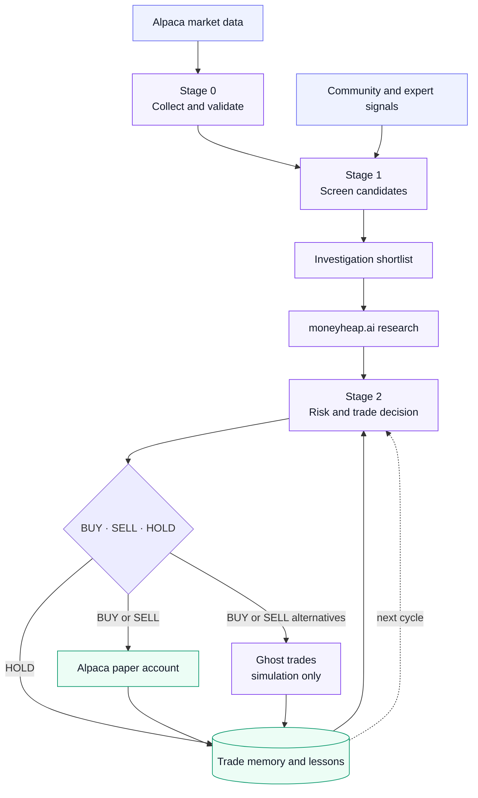

# Alpaca Trading Agent

## One-page write-up

Machine Earning is an autonomous investing agent for people who want to invest
but do not have the time or market expertise to research companies, follow prices,
and manage trades themselves.

The main idea is to build an autonomous trading system that can research
opportunities, make portfolio decisions, execute trades through Alpaca, and learn
from the outcomes.

### AI logic

The system works in three stages.

**Stage 0 collects market data.** It pulls the available US stocks from Alpaca,
recent prices and historical daily bars, validates the data, and stores it locally.

**Stage 1 looks for interesting opportunities.** Instead of asking an LLM to
randomly browse thousands of stocks, normal Python code first reduces the market
to a much smaller shortlist.

It looks for signals such as unusual volume, momentum and breakouts, volatility
expansion, stretched prices, and other unusual market behaviour.

The shortlist is also enriched with external attention signals. For example, what
traders are discussing in online communities and which stocks are currently
attracting analyst attention.

This gives the AI a focused list of companies worth investigating.

**Stage 2 is where the agent takes over.** For promising candidates, the agent
explores fundamental and technical analysis. It then combines that research with
current prices, portfolio exposure, liquidity, existing positions, and its own
risk policy.

For every candidate it can decide to:

**BUY, SELL, or HOLD**

When appropriate, it can choose between trading the stock itself or using an
option.

The agent also keeps persistent memory about its portfolio, previous decisions,
and lessons learned.

### Risk gates

The agent is autonomous, but it is not allowed to trade blindly.

Before taking new risk it checks the current Alpaca account, positions, open
orders, and market state. It forms a portfolio-level risk view first, instead of
treating every ticker independently.

Every trade needs a clear thesis, position size, expected holding period, and an
invalidation condition.

Order execution is handled separately from investment reasoning. Before sending
or changing an order, the agent loads the execution rules, submits the action,
and then checks Alpaca again to confirm what actually happened.

It never assumes that an order was filled just because it was submitted.

There is also a hard safety gate around the trading environment. The project is
configured for **Alpaca paper trading only**. If the expected paper-trading
configuration is not present, the agent must not submit orders.

### Alpaca infrastructure

Alpaca is the source of truth for market and portfolio state.

The system uses Alpaca for:

- market assets and price data
- account state
- current positions
- open orders
- stock and option trading
- order status and reconciliation

Market data is cached locally in SQLite, so the agent does not need to rebuild its
entire dataset on every run.

The workflow can run automatically during the trading day: first updating the
market and shortlist, then running the autonomous trading cycle, and later running
a management-only cycle that can reduce or close risk before the market closes.

### Ghost Trades and Lessons Learned

One extra part of the system is **Ghost Trades**.

When the agent makes a real trade, it can also record alternative decisions it
could have made, such as waiting, choosing a different position size, or using
another instrument.

These alternatives are simulated only. They never reach Alpaca and never affect
the portfolio.

Later, the agent compares the real decision with the ghost alternatives.

That lets it learn not only from obvious mistakes, but also from missed
opportunities and decisions that turned out to be unexpectedly good.

The useful conclusions are stored in a small persistent **lessons learned** memory
and can influence future trading cycles.

The result is an agent that does more than place trades: it continuously
researches, acts, checks itself, and gradually builds its own trading experience.

## What this is

This repository contains an agentic trading workflow for Alpaca paper trading. It
builds a local market-data dataset, screens candidates, and can use
[moneyheap.ai](https://moneyheap.ai)
for fundamental and technical research before supporting risk-managed automated
paper orders with durable trade memory. It never places live trades.

**Stage 0 — Market data.** Collects all Alpaca assets, IEX snapshots, and completed
daily bars, validates them, and maintains a local SQLite dataset for later runs.

**Stage 1 — Candidate discovery.** Screens the market with deterministic signals,
combines the results with community and expert attention, and produces a focused
investigation shortlist.

**Stage 2 — Paper trading.** Researches shortlisted candidates with moneyheap.ai,
applies portfolio and risk checks, chooses BUY, SELL, or HOLD, and tracks real
paper trades alongside simulated ghost alternatives so later cycles can learn
from the comparison.

## Full workflow



Stage 0 builds a local whole-market dataset from Alpaca's US-equity asset list,
IEX snapshots, and IEX daily bars. The cache is SQLite so later runs update only
bars newer than each symbol's latest cached bar.

## Setup

Create a local `.env` from `.env.example`; `.env` and other environment-specific
files are ignored by Git. Set the Alpaca credentials in your local file before
running the agent.

The implementation uses only the Python standard library:

```bash
python3 -m alpaca_agent
```

Useful configuration variables are in `.env.example`. In particular,
`ALPACA_BATCH_SIZE` defaults to 100 and `ALPACA_HISTORY_DAYS` defaults to 120,
which provides a buffer above Stage 1's 100 completed daily bars.

The command writes:

- `data/market.sqlite3`: `assets`, `snapshots`, `bars`, `fetch_errors`, and metadata tables.
- `data/stage0_manifest.json`: counts, feed, table names, and errors from the run.

Run with temporary paths when testing:

```bash
python3 -m alpaca_agent --db-path /tmp/alpaca-market.sqlite3 \
  --manifest-path /tmp/alpaca-stage0.json
```

For a bounded bootstrap or smoke test, limit the universe:

```bash
python3 -m alpaca_agent --max-symbols 100
```

Run the dependency-free test suite with:

```bash
python3 -m unittest discover -v
```

## Local data interface for Stage 1

Screening code should use `MarketStore.load_dataset()` and not the Alpaca client:

```python
from pathlib import Path

from alpaca_agent import MarketStore

with MarketStore(Path("data/market.sqlite3")) as store:
    dataset = store.load_dataset()
    bars_for_aapl = dataset.history.get("AAPL", ())
    current_aapl = dataset.snapshots.get("AAPL")
```

`dataset.assets`, `dataset.snapshots`, and `dataset.history` are the stable local
representations that Stage 1 can consume.

## Stage 1 deterministic screen

Stage 1 uses only completed daily IEX bars and includes a separate ApeWisdom
community-interest step. It fetches the top 50 results from both the
`all-stocks` and `options` feeds, then deduplicates them in the candidate list.

Run the historical-safe screen with:

```bash
python3 -m alpaca_agent.stage1 \
  --db-path data/market.sqlite3 \
  --as-of-date 2026-08-24
```

The program writes machine-readable JSON to `data/stage1_screen.json` by
default and logs only a compact lane summary to stderr. Use `--output` to
change the path, `--no-community` to skip ApeWisdom, or `--print-json` to also
print the JSON to stdout.
The Python API is:

```python
from datetime import date
from pathlib import Path

from alpaca_agent.community import ApeWisdomClient
from alpaca_agent import MarketStore, Stage1Screener
from alpaca_agent.stage1 import DEFAULT_SCREENING_CONFIG

with MarketStore(Path("data/market.sqlite3")) as store:
    config = DEFAULT_SCREENING_CONFIG
    result = Stage1Screener(
        store.load_dataset(),
        config,
        ApeWisdomClient(config.community.base_url, config.community.timeout_seconds),
    ).screen(date(2026, 8, 24))
```

## Stage 1 investigation shortlist

Build a Markdown shortlist for downstream investigation agents:

```bash
python3 -m alpaca_agent.shortlist
```

The command reads `data/stage1_screen.json` and `data/stage1_experts.json` and
writes `data/stage1_shortlist.md`. It selects the top 10 unique community
tickers by their best rank across community feeds, the first 10 expert
candidates in expert-source order, and the top 20 technical candidates by
Reciprocal Rank Fusion with `k=10`. Technical category ranks use descending
category score with ticker order as the tie-breaker. Scoreless categories such
as `exploration` and the community category are excluded from technical RRF.

Input and output paths, selection sizes, and RRF `k` can be changed with the
`--screen`, `--experts`, `--output`, `--community-top-k`, `--expert-top-k`,
`--rrf-top-k`, and `--rrf-k` options.

Results are multi-label and reproducible for identical bars, configuration, and
screening date. The exploration lane uses the date as its deterministic seed.
Community rankings are a current ApeWisdom snapshot; use `--no-community` for
market-only historical runs or inject a fixed client response for replay.

## Stage 2 autonomous paper trader

The project skill at `.agents/skills/alpaca-paper-trader` runs Stage 2 from the
latest `data/stage1_shortlist.md`. It may research tickers through moneyheap,
makes separate stock and option decisions, applies the risk policy, and submits
valid Alpaca paper orders without human approval.

Moneyheap persistence is handled by `python3 -m alpaca_agent.moneyheap`: pass one
request JSON object on stdin. It makes the request once, saves the exact response
to a sibling JSON artifact, and writes one rendered Markdown artifact under
`memory/research/`. A local write failure is retried locally and never recovered
by issuing another successful research request.

Each filled trade also starts a small set of realistic ghost alternatives that
are evaluated over the same market-data window without ever reaching Alpaca or
affecting the portfolio. Completed real-versus-ghost comparisons can update the
short, durable principles in `memory/lessons.md`; those principles inform later
decisions as learned priors rather than hard rules.

Invoke it as `$alpaca-paper-trader`. Its durable state is stored in `memory/`.
The skill contains instructions and references only; it adds no Stage 2 script.

## Daily autonomous pipeline

`alpaca_agent.daily_shortlist` runs Stage 0, Stage 1, and the shortlist builder.
Codex owns the weekday schedule: a Luna automation invokes expert-attention
discovery and then runs this deterministic pipeline at 16:00 Europe/Amsterdam.
It runs only when Alpaca reports that the market is open, New York time is at
least 10:00, and that market date has not already completed. A separate Sol
automation runs Stage 2 at 16:30 only after verifying the current market day's
completion marker and fresh Stage 1 artifacts. A management-only pre-close
automation starts at 20:30 Europe/Amsterdam and uses the Alpaca clock to enter
the 15:15–15:50 New York window. It may hold, reduce, close, cancel, or replace
existing exposure and orders, but it cannot open or enlarge a position.

Check whether a run is due without changing any data:

```bash
python3 -m alpaca_agent.daily_shortlist --check-only
```

Run it manually with:

```bash
python3 -m alpaca_agent.daily_shortlist --force
```

The completion marker is `data/daily_shortlist_state.json`. The legacy macOS
LaunchAgent in `automation/` is retained only as a reference and must remain
unloaded while the Codex automations are active.

## Data-quality and feed behavior

- Assets are filtered to `active`, `tradable`, `us_equity` records from `/v2/assets`.
- Snapshots and bars are requested in configurable batches, with `feed=iex`.
- HTTP 429, 5xx, timeout, and network failures are retried with exponential backoff and jitter.
- A failed batch is recorded and does not abort later batches.
- Missing symbols and invalid bars are recorded in `fetch_errors`.
- Bars require positive close, `high >= low`, OHLC values inside the high/low range,
  non-negative volume, and a parseable date.
- Historical requests end at the previous New York calendar day so Stage 1 does
  not accidentally use an in-progress daily candle.
- IEX volumes are only IEX volumes; they must not be interpreted as consolidated
  US-market volume.
